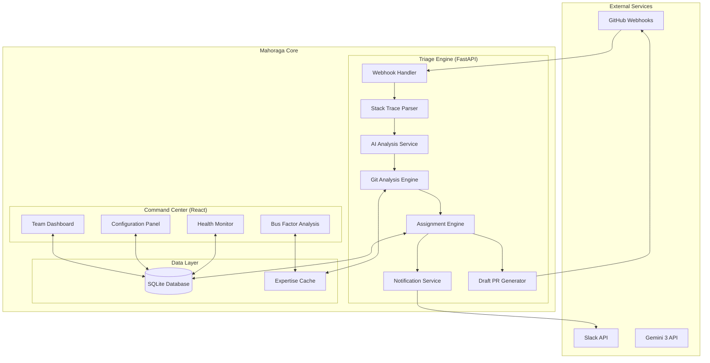

# Design Document - Mahoraga

## Overview

Mahoraga is an autonomous bug triage agent that revolutionizes how engineering teams handle incident response. Unlike traditional triage tools that simply route tickets, Mahoraga analyzes bugs, identifies exact code locations, calculates true ownership from git history, and drafts fixes before humans even see the ticket.

The system consists of two main components:
1. **Triage Engine** - A headless FastAPI service that processes GitHub webhooks and performs autonomous analysis
2. **Command Center** - A React dashboard that visualizes team health, triage decisions, and provides configuration management

**Core Innovation:** The "Pre-Solver" paradigm - moving from "route to human" to "route + diagnose + draft fix"

## Architecture

### System Architecture



### Technology Stack

| Layer                | Technology               | Purpose                                   |
| -------------------- | ------------------------ | ----------------------------------------- |
| **Backend API**      | FastAPI + Python 3.11    | High-performance async webhook processing |
| **AI Analysis**      | Google Gemini 3          | Code understanding and fix generation     |
| **Git Operations**   | GitPython + GitHub API   | Repository analysis and PR creation       |
| **Database**         | SQLite                   | Lightweight persistence for MVP           |
| **Frontend**         | React 18 + Vite          | Real-time dashboard and configuration     |
| **Styling**          | Tailwind CSS + shadcn/ui | Rapid UI development with design system   |
| **State Management** | TanStack Query           | API caching and real-time updates         |
| **Charts**           | Recharts                 | Team load and bus factor visualizations   |
| **Notifications**    | Slack SDK                | Developer notifications                   |

## Components and Interfaces

### Triage Engine (Backend)

#### Webhook Handler
```python
@app.post("/webhook/github")
async def handle_github_webhook(request: Request):
    # Verify webhook signature
    # Parse issue/PR events
    # Trigger triage pipeline
    pass
```

**Responsibilities:**
- Verify GitHub webhook signatures (HMAC-SHA256)
- Parse incoming issue and PR events
- Deduplicate issues within 10-minute window
- Queue triage jobs for async processing

#### Stack Trace Parser
```python
class StackTraceParser:
    def parse_stack_trace(self, issue_body: str) -> StackTrace:
        # Extract file paths and line numbers
        # Identify error types and messages
        # Rank stack frames by relevance
        pass
```

**Responsibilities:**
- Extract file paths, line numbers, and function names from stack traces
- Handle multiple stack trace formats (Python, JavaScript, Java, etc.)
- Identify the most relevant frames for analysis
- Extract error messages and exception types

#### Git Analysis Engine
```python
class GitAnalysisEngine:
    def calculate_expertise_score(self, file_path: str) -> List[ExpertiseScore]:
        # Execute git blame -w -C -C -M
        # Calculate weighted ownership scores
        # Filter out bots and merge commits
        # Handle file renames and moves
        pass
```

**Responsibilities:**
- Execute git blame with rename/move tracking
- Calculate expertise scores based on commit frequency, recency, and line ownership
- Filter out automated commits and bot accounts
- Cache results to avoid repeated git operations
- Handle inactive users and fallback to secondary contributors

#### AI Analysis Service
```python
class AIAnalysisService:
    async def analyze_bug(self, stack_trace: StackTrace, code_context: str) -> BugAnalysis:
        # Call Gemini 3 for code understanding
        # Generate plain English explanations
        # Identify likely root causes
        # Suggest potential fixes
        pass
```

**Responsibilities:**
- Analyze bug context using Gemini 3
- Generate human-readable explanations of technical issues
- Identify affected code beyond the stack trace
- Assess fix complexity and confidence levels

#### Assignment Engine
```python
class AssignmentEngine:
    def calculate_assignment(self, bug_analysis: BugAnalysis, expertise_scores: List[ExpertiseScore]) -> Assignment:
        # Combine AI analysis with git expertise
        # Calculate confidence score (0-100)
        # Apply business rules (workload, availability)
        # Generate assignment reasoning
        pass
```

**Responsibilities:**
- Combine AI analysis with git expertise data
- Calculate confidence scores for assignment decisions
- Apply workload balancing and availability rules
- Generate human-readable assignment reasoning
- Route low-confidence assignments to human triage

#### Draft PR Generator
```python
class DraftPRGenerator:
    async def generate_draft_fix(self, bug_analysis: BugAnalysis, confidence: float) -> Optional[DraftPR]:
        # Only proceed if confidence > 85%
        # Generate single-file fixes < 20 lines
        # Create GitHub PR with draft status
        # Include explanatory comments
        pass
```

**Responsibilities:**
- Generate code fixes for high-confidence bugs (>85%)
- Limit scope to single-file changes under 20 lines
- Create GitHub PRs with clear draft labeling
- Include explanatory comments and reasoning
- Handle edge cases and error conditions gracefully

### Command Center (Frontend)

#### Design System Integration

Based on the provided branding.json, the frontend will implement:

```css
/* Color Palette */
:root {
  --primary: #1A73E8;
  --accent: #FBE0DD;
  --background: #FAF9F5;
  --text-primary: #141413;
  --link: #FBE0DD;
}

/* Typography */
.font-primary {
  font-family: anthropicSans, system-ui, -apple-system, sans-serif;
}

.font-heading {
  font-family: anthropicSerif, Georgia, serif;
}

/* Spacing */
.base-unit {
  --spacing: 4px;
  --border-radius: 10px;
}
```

#### Team Dashboard Component
```tsx
interface TeamDashboardProps {
  developers: Developer[];
  recentTriage: TriageDecision[];
  refreshInterval: number;
}

export function TeamDashboard({ developers, recentTriage }: TeamDashboardProps) {
  // Real-time bug count visualization
  // Load balancing warnings
  // Recent triage decision feed
  // Auto-refresh every 30 seconds
}
```

**Features:**
- Real-time bar charts showing bug counts per developer
- Warning indicators for overloaded team members (>5 bugs)
- Live feed of recent triage decisions with confidence scores
- Auto-refresh functionality with loading states

#### Bus Factor Monitor Component
```tsx
interface BusFactorMonitorProps {
  riskFiles: RiskFile[];
  ownershipData: OwnershipData[];
}

export function BusFactorMonitor({ riskFiles, ownershipData }: BusFactorMonitorProps) {
  // Knowledge concentration visualization
  // Single-owner file warnings
  // Suggested knowledge transfer assignments
}
```

**Features:**
- Visual list of files with single active contributors
- Percentage ownership calculations per developer
- Knowledge risk warnings with suggested actions
- Integration with assignment engine for knowledge transfer

#### Configuration Panel Component
```tsx
interface ConfigurationPanelProps {
  settings: SystemSettings;
  onSettingsChange: (settings: SystemSettings) => void;
}

export function ConfigurationPanel({ settings, onSettingsChange }: ConfigurationPanelProps) {
  // User mapping management (Git email ↔ Slack ID)
  // Confidence threshold adjustment
  // Draft PR mode toggle
  // Duplicate detection window settings
}
```

**Features:**
- Searchable table for user mappings
- Real-time settings adjustment with immediate effect
- Input validation and error handling
- Bulk import/export functionality for user mappings

## Data Models

### Core Entities

```python
@dataclass
class StackTrace:
    frames: List[StackFrame]
    error_message: str
    error_type: str
    language: str

@dataclass
class StackFrame:
    file_path: str
    line_number: int
    function_name: str
    code_snippet: str
    relevance_score: float

@dataclass
class ExpertiseScore:
    developer: Developer
    file_path: str
    score: float
    commit_count: int
    last_commit_date: datetime
    lines_owned: int

@dataclass
class BugAnalysis:
    affected_files: List[str]
    root_cause_hypothesis: str
    plain_english_explanation: str
    fix_complexity: str  # "simple", "moderate", "complex"
    confidence: float

@dataclass
class Assignment:
    assignee: Developer
    confidence: float
    reasoning: str
    estimated_effort: str
    priority: str

@dataclass
class DraftPR:
    title: str
    description: str
    file_changes: Dict[str, str]
    pr_url: str
    confidence: float
```

### Database Schema

```sql
-- User Management
CREATE TABLE users (
    id INTEGER PRIMARY KEY,
    git_email TEXT UNIQUE NOT NULL,
    slack_id TEXT UNIQUE NOT NULL,
    display_name TEXT NOT NULL,
    is_active BOOLEAN DEFAULT TRUE,
    created_at TIMESTAMP DEFAULT CURRENT_TIMESTAMP
);

-- Assignment History
CREATE TABLE assignments (
    id INTEGER PRIMARY KEY,
    issue_id TEXT NOT NULL,
    issue_url TEXT NOT NULL,
    assigned_to_email TEXT NOT NULL,
    confidence REAL NOT NULL,
    reasoning TEXT NOT NULL,
    status TEXT DEFAULT 'assigned', -- assigned, completed, reassigned
    created_at TIMESTAMP DEFAULT CURRENT_TIMESTAMP,
    FOREIGN KEY (assigned_to_email) REFERENCES users(git_email)
);

-- Expertise Cache
CREATE TABLE expertise_cache (
    id INTEGER PRIMARY KEY,
    file_path TEXT NOT NULL,
    developer_email TEXT NOT NULL,
    score REAL NOT NULL,
    commit_count INTEGER NOT NULL,
    last_commit_date TIMESTAMP NOT NULL,
    lines_owned INTEGER NOT NULL,
    calculated_at TIMESTAMP DEFAULT CURRENT_TIMESTAMP,
    UNIQUE(file_path, developer_email)
);

-- Triage Decisions
CREATE TABLE triage_decisions (
    id INTEGER PRIMARY KEY,
    issue_id TEXT NOT NULL,
    stack_trace TEXT,
    affected_files TEXT, -- JSON array
    root_cause TEXT,
    confidence REAL NOT NULL,
    draft_pr_url TEXT,
    processing_time_ms INTEGER,
    created_at TIMESTAMP DEFAULT CURRENT_TIMESTAMP
);

-- System Configuration
CREATE TABLE system_config (
    key TEXT PRIMARY KEY,
    value TEXT NOT NULL,
    updated_at TIMESTAMP DEFAULT CURRENT_TIMESTAMP
);
```

### API Interfaces

#### Backend API Endpoints

```python
# Webhook Processing
POST /webhook/github
  - Receives GitHub issue/PR webhooks
  - Returns: 200 OK (async processing)

# Dashboard Data
GET /api/dashboard/stats
  - Returns: team load data, recent decisions
  
GET /api/dashboard/bus-factor
  - Returns: knowledge risk analysis
  
GET /api/dashboard/health
  - Returns: system health metrics

# Configuration
GET /api/config/users
  - Returns: user mappings list
  
POST /api/config/users
  - Body: { git_email, slack_id, display_name }
  - Returns: created user mapping
  
PUT /api/config/settings
  - Body: { confidence_threshold, draft_pr_enabled, ... }
  - Returns: updated settings

# Assignment Management
GET /api/assignments/history
  - Query: limit, offset, status
  - Returns: paginated assignment history
  
POST /api/assignments/{id}/reassign
  - Body: { new_assignee_email, reason }
  - Returns: updated assignment
```

#### Frontend API Integration

```typescript
// API Client with TanStack Query
export const useTeamStats = () => {
  return useQuery({
    queryKey: ['team-stats'],
    queryFn: () => api.get('/api/dashboard/stats'),
    refetchInterval: 30000, // 30 second refresh
  });
};

export const useBusFactorData = () => {
  return useQuery({
    queryKey: ['bus-factor'],
    queryFn: () => api.get('/api/dashboard/bus-factor'),
    refetchInterval: 300000, // 5 minute refresh
  });
};

export const useUpdateSettings = () => {
  const queryClient = useQueryClient();
  return useMutation({
    mutationFn: (settings: SystemSettings) => 
      api.put('/api/config/settings', settings),
    onSuccess: () => {
      queryClient.invalidateQueries({ queryKey: ['system-config'] });
    },
  });
};
```

Now I need to use the prework tool to analyze the acceptance criteria before writing the correctness properties section.

<function_calls>
<invoke name="prework">
<parameter name="featureName">ticket-triage

## Correctness Properties

*A property is a characteristic or behavior that should hold true across all valid executions of a system—essentially, a formal statement about what the system should do. Properties serve as the bridge between human-readable specifications and machine-verifiable correctness guarantees.*

After analyzing the acceptance criteria, I've identified the following testable properties that can be validated through property-based testing:

### Property 1: Stack Trace Parsing Completeness
*For any* valid stack trace input, the parser should extract at least one file path and line number combination
**Validates: Requirements 1.2**

### Property 2: Duplicate Detection Consistency  
*For any* pair of identical issues submitted within the 10-minute window, the system should detect them as duplicates and consolidate them
**Validates: Requirements 1.3**

### Property 3: Keyword Extraction Coverage
*For any* bug description containing error keywords, the system should extract at least one relevant keyword or severity signal
**Validates: Requirements 1.4**

### Property 4: Git Blame Command Correctness
*For any* file path analysis, the git blame command should include the -C -C -M flags for rename and move tracking
**Validates: Requirements 2.1**

### Property 5: Expertise Score Recency Weighting
*For any* set of commits with different timestamps, more recent commits should receive higher weights in the expertise score calculation
**Validates: Requirements 2.2**

### Property 6: Bot Account Filtering
*For any* git history containing bot accounts or automated commits, these should be filtered out from expertise calculations
**Validates: Requirements 2.3**

### Property 7: Inactive User Fallback
*For any* file where the primary author is marked inactive, the system should identify and propose secondary contributors as assignees
**Validates: Requirements 2.4**

### Property 8: Human Triage Routing
*For any* file with no active contributors, the assignment should be routed to the human triage queue instead of auto-assignment
**Validates: Requirements 2.5**

### Property 9: Confidence Score Bounds
*For any* assignment calculation, the confidence score should always be between 0 and 100 inclusive
**Validates: Requirements 3.1**

### Property 10: Low Confidence Routing
*For any* assignment with confidence below 60%, the system should route to human triage instead of auto-assignment
**Validates: Requirements 3.2**

### Property 11: Assignment Loop Prevention
*For any* bug assignment, the decision should be recorded to prevent the same bug from being reassigned to the same person
**Validates: Requirements 3.3**

### Property 12: Workload-Based Tie Breaking
*For any* scenario where multiple developers have similar expertise scores, the selection should favor the developer with lower current workload
**Validates: Requirements 3.4**

### Property 13: Inactive User Exclusion
*For any* assignee lookup, inactive users should never appear in the candidate list
**Validates: Requirements 4.3**

### Property 14: Notification Content Completeness
*For any* bug assignment notification, it should include file path, line number, expertise reason, and confidence score
**Validates: Requirements 5.2**

### Property 15: Low Confidence Escalation
*For any* assignment with low confidence, the on-call engineer should receive a manual triage notification instead of the auto-assignment notification
**Validates: Requirements 5.3**

### Property 16: Draft PR Link Inclusion
*For any* notification where a draft PR was generated, the notification should include a link to the proposed fix
**Validates: Requirements 5.4**

### Property 17: AI Analysis Invocation
*For any* bug report analysis, the Gemini 3 API should be called to identify affected files beyond the stack trace
**Validates: Requirements 6.1**

### Property 18: Explanation Generation
*For any* bug analysis where code context is available, a plain English explanation should be generated
**Validates: Requirements 6.2**

### Property 19: Stack Frame Relevance Ranking
*For any* complex stack trace, the system should identify and rank the most relevant frames for human attention
**Validates: Requirements 6.3**

### Property 20: Error Message Translation
*For any* cryptic error message, the system should generate an actionable description
**Validates: Requirements 6.4**

### Property 21: High Confidence Draft Generation
*For any* bug analysis with confidence exceeding 85%, a draft code fix should be generated
**Validates: Requirements 7.1**

### Property 22: Draft Fix Constraints
*For any* generated draft fix, it should modify only a single file with fewer than 20 lines changed
**Validates: Requirements 7.2**

### Property 23: Draft PR Labeling
*For any* created draft PR, it should be clearly labeled as "DRAFT - Review Required"
**Validates: Requirements 7.3**

### Property 24: Fix Comment Inclusion
*For any* generated code fix, explanatory comments describing the change reasoning should be included
**Validates: Requirements 7.4**

### Property 25: Overload Warning Threshold
*For any* developer with more than 5 active bugs, the Command Center should display a warning indicator
**Validates: Requirements 8.2**

### Property 26: Single Contributor Detection
*For any* git repository analysis, files with only one active contributor should be correctly identified
**Validates: Requirements 9.1**

### Property 27: Knowledge Risk Display
*For any* files with single owners that are marked as critical, they should appear in the "Knowledge Risk" section
**Validates: Requirements 9.2**

### Property 28: Ownership Percentage Calculation
*For any* developer and repository, the percentage of files they uniquely own should be calculated correctly
**Validates: Requirements 9.3**

### Property 29: Knowledge Transfer Suggestions
*For any* detected bus factor risk, appropriate junior developers should be suggested for knowledge transfer assignments
**Validates: Requirements 9.4**

### Property 30: Data Persistence Round Trip
*For any* assignment history, user mapping, or expertise cache entry, storing and retrieving the data should preserve all information
**Validates: Requirements 10.2**

### Property 31: Restart Data Recovery
*For any* system restart, all previously stored configuration and historical data should be restored correctly
**Validates: Requirements 10.3**

### Property 32: Decision Logging Completeness
*For any* triage decision, it should be logged with complete reasoning information for debugging and audit purposes
**Validates: Requirements 10.4**

### Property 33: Graceful API Failure Handling
*For any* external API failure (GitHub, Slack, Gemini), the system should degrade gracefully and notify administrators
**Validates: Requirements 10.5**

### Property 34: Immediate Configuration Application
*For any* configuration change made through the Command Center, it should take effect immediately without requiring a restart
**Validates: Requirements 11.4**

### Property 35: API Timeout and Retry Implementation
*For any* external API call (GitHub, Slack, Gemini), timeout and retry logic should be implemented correctly
**Validates: Requirements 12.3**

### Property 36: Webhook Signature Verification
*For any* received GitHub webhook, the signature should be verified before processing the payload
**Validates: Requirements 12.5**

## Error Handling

### Graceful Degradation Strategy

The system implements a multi-tier fallback approach:

1. **AI Service Failure**: If Gemini 3 is unavailable, fall back to regex-based analysis and route to human triage
2. **GitHub API Failure**: Cache git blame results and use stale data with warnings
3. **Slack API Failure**: Log notifications locally and retry with exponential backoff
4. **Database Failure**: Operate in read-only mode with in-memory caching

### Error Categories and Responses

| Error Type                 | Response Strategy                      | User Impact                   |
| -------------------------- | -------------------------------------- | ----------------------------- |
| **Webhook Timeout**        | Return 200 OK, process async           | None - transparent retry      |
| **Invalid Stack Trace**    | Route to human triage                  | Manual analysis required      |
| **Git Repository Access**  | Use cached expertise data              | Slightly stale ownership info |
| **AI Analysis Failure**    | Skip draft PR, proceed with assignment | No draft fix generated        |
| **Slack Delivery Failure** | Queue for retry, email fallback        | Delayed notification          |

### Circuit Breaker Pattern

```python
class CircuitBreaker:
    def __init__(self, failure_threshold: int = 5, timeout: int = 60):
        self.failure_count = 0
        self.failure_threshold = failure_threshold
        self.timeout = timeout
        self.last_failure_time = None
        self.state = "CLOSED"  # CLOSED, OPEN, HALF_OPEN
```

Applied to:
- Gemini 3 API calls
- GitHub API operations  
- Slack notification delivery

## Testing Strategy

### Dual Testing Approach

The system requires both unit testing and property-based testing for comprehensive coverage:

**Unit Tests** focus on:
- Specific examples and edge cases
- Integration points between components
- Error conditions and boundary values
- UI component behavior and user interactions

**Property-Based Tests** focus on:
- Universal properties that hold across all inputs
- Comprehensive input coverage through randomization
- Correctness properties derived from requirements
- System behavior under varied conditions

### Property-Based Testing Configuration

**Framework**: Hypothesis (Python) for backend, fast-check (TypeScript) for frontend
**Test Configuration**:
- Minimum 100 iterations per property test
- Each test tagged with feature and property reference
- Tag format: **Feature: ticket-triage, Property {number}: {property_text}**

**Example Property Test**:
```python
from hypothesis import given, strategies as st

@given(st.lists(st.text(), min_size=1))
def test_expertise_score_recency_weighting(commit_timestamps):
    """Feature: ticket-triage, Property 5: Expertise Score Recency Weighting"""
    # Generate commits with different timestamps
    commits = [create_commit(ts) for ts in sorted(commit_timestamps)]
    scores = calculate_expertise_scores(commits)
    
    # Verify more recent commits have higher weights
    for i in range(len(scores) - 1):
        assert scores[i].weight >= scores[i + 1].weight
```

### Unit Testing Strategy

**Backend Testing** (pytest):
- API endpoint testing with FastAPI TestClient
- Database operations with in-memory SQLite
- Mock external services (GitHub, Slack, Gemini)
- Git operations with test repositories

**Frontend Testing** (Vitest + React Testing Library):
- Component rendering and user interactions
- API integration with MSW (Mock Service Worker)
- Real-time updates and auto-refresh behavior
- Configuration panel functionality

### Integration Testing

**End-to-End Scenarios**:
1. GitHub webhook → Stack trace parsing → Assignment → Slack notification
2. High confidence bug → Draft PR generation → GitHub PR creation
3. Configuration change → Immediate system behavior update
4. API failure → Graceful degradation → Administrator notification

**Test Environment**:
- Docker containers for isolated testing
- Test GitHub repository with controlled history
- Mock Slack workspace for notification testing
- Gemini 3 API with test quota allocation

### Performance Testing

**Load Testing Scenarios**:
- Concurrent webhook processing (10 simultaneous)
- Large repository git blame operations (10,000+ commits)
- Dashboard real-time updates under load
- Database query performance with historical data

**Performance Targets**:
- Webhook processing: < 10 seconds end-to-end
- Git blame operations: < 5 seconds for repos under 10,000 commits
- Dashboard initial load: < 2 seconds
- Real-time updates: < 1 second latency