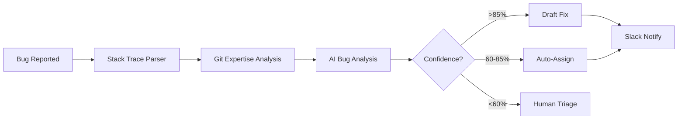
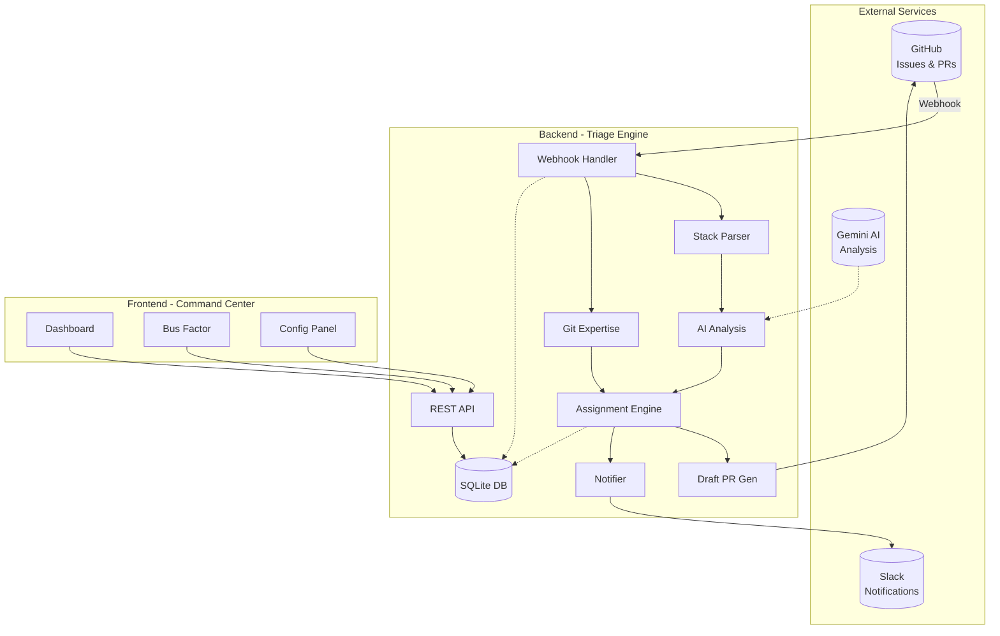
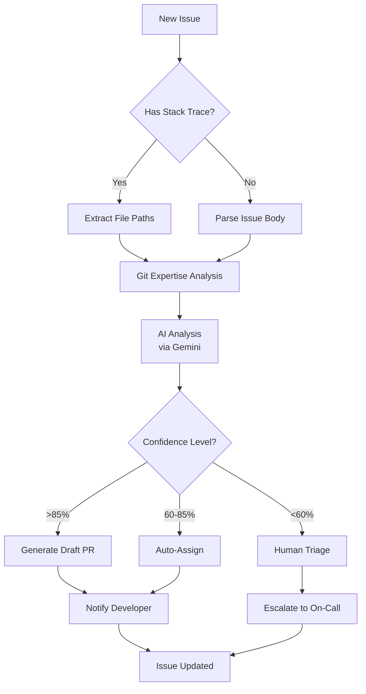
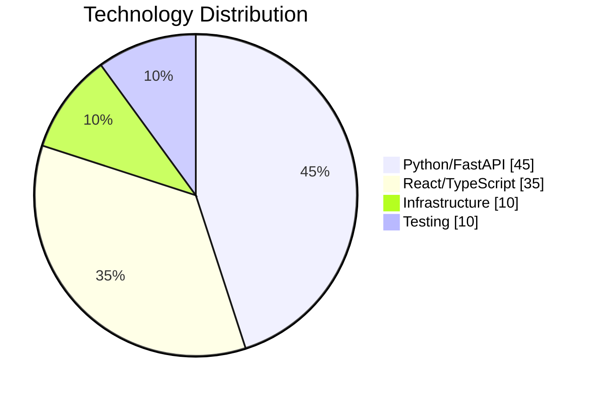

# Mahoraga - Autonomous Bug Triage System

<div align="center">

[](LICENSE)
[](https://python.org)
[](https://react.dev)
[](https://fastapi.tiangolo.com)

**Intelligent bug triage that identifies code locations, calculates ownership, and drafts fixes—before humans see the ticket.**

</div>

---

## Overview

Mahoraga is an autonomous bug triage agent that combines AI analysis, git history mining, and intelligent routing to automatically assign bugs to the most qualified developers. Named after the Buddhist concept of adaptive response, Mahoraga learns and adapts to your codebase.



---

## Key Features

| Feature | Description |
|---------|-------------|
| **Smart Assignment** | AI-powered developer matching based on expertise and availability |
| **Stack Trace Analysis** | Multi-language parser (Python, JavaScript, Java) |
| **Git Expertise Mining** | Recency-weighted ownership scoring from git history |
| **Draft PR Generation** | Auto-generates fix PRs for high-confidence bugs |
| **Slack Integration** | Instant notifications with retry logic |
| **Circuit Breakers** | Graceful degradation for external services |
| **Bus Factor Analysis** | Code ownership distribution and risk warnings |

---

## System Architecture



---

## Project Structure

```
mahoraga/
├── backend/                  # FastAPI triage engine
│   ├── main.py              # Application entry point
│   ├── api_endpoints.py     # REST API routes
│   ├── ai_analysis_service.py
│   ├── assignment_engine.py
│   ├── git_analysis_engine.py
│   ├── stack_trace_parser.py
│   ├── webhook_handler.py
│   ├── slack_notification_service.py
│   ├── draft_pr_generator.py
│   ├── error_handling.py
│   └── database.py
├── frontend/                 # React Command Center
│   ├── src/
│   │   ├── components/
│   │   ├── pages/
│   │   ├── hooks/
│   │   └── lib/
│   └── package.json
├── docs/                     # Documentation
├── demo/                     # Demo materials
├── docker-compose.yml
└── README.md
```

---

## Quick Start

### Prerequisites

- Python 3.11+
- Node.js 18+
- Git

### Backend Setup

```bash
# Navigate to backend
cd backend

# Create virtual environment
python -m venv venv

# Activate (Windows)
venv\Scripts\activate
# Activate (macOS/Linux)
source venv/bin/activate

# Install dependencies
pip install -r requirements.txt

# Configure environment
cp .env.example .env
# Edit .env with your API keys

# Start server
python main.py
```

Backend available at: `http://localhost:8000`

### Frontend Setup

```bash
# Navigate to frontend
cd frontend

# Install dependencies
npm install

# Start development server
npm run dev
```

Frontend available at: `http://localhost:5173`

### Docker Setup

```bash
docker-compose up --build
```

---

## Configuration

### Environment Variables

| Variable | Description | Required |
|----------|-------------|----------|
| `GITHUB_TOKEN` | GitHub personal access token | Yes |
| `GITHUB_WEBHOOK_SECRET` | Webhook signature verification | Yes |
| `SLACK_BOT_TOKEN` | Slack bot token | Yes |
| `GEMINI_API_KEY` | Google Gemini API key | Yes |
| `CONFIDENCE_THRESHOLD` | Assignment threshold (default: 60.0) | No |
| `DRAFT_PR_ENABLED` | Enable draft PRs (default: true) | No |

---

## Processing Pipeline

The triage pipeline processes bugs through multiple stages with configurable confidence thresholds:



---

## API Reference

### Webhook Endpoints
| Method | Endpoint | Description |
|--------|----------|-------------|
| `POST` | `/webhook/github` | GitHub webhook receiver |

### Dashboard Endpoints
| Method | Endpoint | Description |
|--------|----------|-------------|
| `GET` | `/api/dashboard/stats` | Team statistics and metrics |
| `GET` | `/api/dashboard/bus-factor` | Code ownership analysis |

### Configuration Endpoints
| Method | Endpoint | Description |
|--------|----------|----------|
| `GET` | `/api/config/settings` | Current settings |
| `PUT` | `/api/config/settings` | Update settings |
| `GET` | `/api/config/users` | User mappings |
| `POST` | `/api/config/users` | Create user mapping |

### Health Endpoints
| Method | Endpoint | Description |
|--------|----------|-------------|
| `GET` | `/health` | Basic health check |
| `GET` | `/health/detailed` | Detailed status with metrics |

---

## Testing

### Backend Tests

```bash
cd backend
source venv/bin/activate  # Windows: venv\Scripts\activate

# Run all tests
pytest -v

# Run with coverage
pytest --cov=. --cov-report=html

# Run specific suites
pytest test_integration.py -v
pytest test_draft_pr_generator.py -v
```

### Frontend Tests

```bash
cd frontend
npm run test
```

---

## Technology Stack



### Backend Stack
- **Framework**: FastAPI 0.104+
- **Database**: SQLAlchemy + SQLite
- **AI**: Google Gemini
- **Testing**: pytest + Hypothesis

### Frontend Stack
- **Framework**: React 18 + TypeScript
- **Styling**: Tailwind CSS 3
- **Components**: Radix UI (shadcn/ui)
- **Charts**: Recharts
- **Build**: Vite 5

---

## Documentation

- [Architecture Documentation](docs/architecture.md)
- [Demo Script](demo/demo_script.md)

---
### License

This project is licensed under the MIT License - see the [LICENSE](LICENSE) file for details.

Made in Kenya

---

<div align="center">

**Built for the DX Hackathon**

</div>