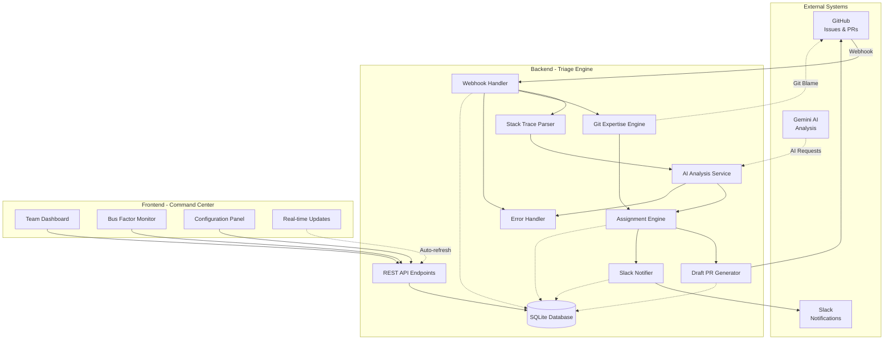
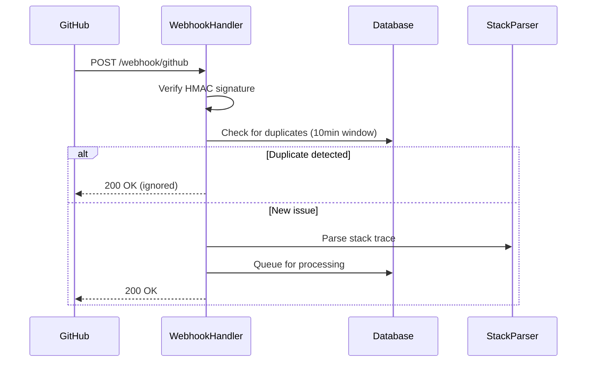
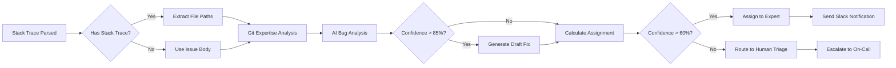
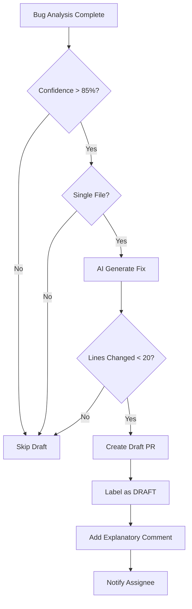
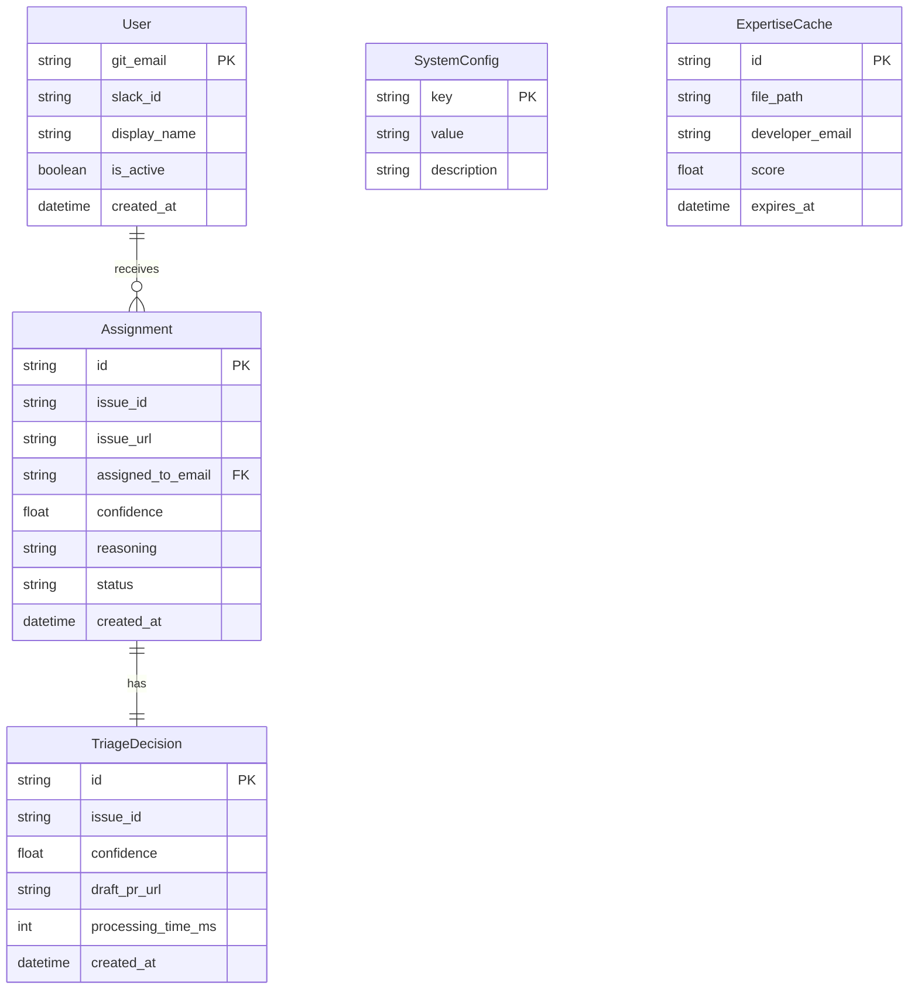

# Mahoraga System Architecture

## Overview

Mahoraga is an autonomous bug triage system that combines AI analysis, git history mining, and intelligent routing to automatically assign bugs to the most qualified developers.

## System Architecture Diagram



## Component Interactions

### 1. Webhook Reception Flow



### 2. Triage Processing Pipeline



### 3. Draft PR Generation Flow



## Technology Stack

### Backend (Python)
- **Web Framework**: FastAPI 0.104+
- **Database**: SQLAlchemy + SQLite
- **Testing**: pytest + Hypothesis (property-based)
- **AI Integration**: Google Generative AI (Gemini)
- **Git Operations**: PyGithub + subprocess
- **Notifications**: Slack SDK

### Frontend (TypeScript/React)
- **Framework**: React 18 + TypeScript
- **Build Tool**: Vite 5
- **Styling**: Tailwind CSS 3
- **UI Components**: Radix UI (shadcn/ui)
- **State Management**: TanStack Query
- **Charts**: Recharts
- **Testing**: Vitest + Testing Library

### Infrastructure
- **Containers**: Docker + Docker Compose
- **Web Server**: Uvicorn (ASGI)
- **Dev Server**: Vite Dev Server
- **Database**: SQLite (development), PostgreSQL-ready (production)

## Data Models

### Core Entities



## Key Features & Algorithms

### 1. Git Expertise Calculation

**Algorithm**: Recency-weighted ownership scoring

```
expertise_score = (commit_count * recency_weight) + (lines_owned / total_lines) * 100

where:
  recency_weight = e^(-days_since_commit / 90)
  - Recent commits weighted higher
  - Exponential decay over 90 days
```

**Implementation**: Uses `git blame` with `-w -C -C -M` flags
- `-w`: Ignore whitespace changes
- `-C -C`: Detect code movement across files
- `-M`: Detect code movement within files

### 2. Confidence Scoring

**Factors**:
1. AI analysis confidence (0-100%)
2. Stack trace clarity (weighted)
3. Code ownership certainty
4. Historical success rate

**Thresholds**:
- **>85%**: Auto-generate draft PR
- **60-85%**: Auto-assign with notification
- **<60%**: Route to human triage

### 3. Duplicate Detection

**Method**: Time-window based deduplication
- 10-minute sliding window (configurable)
- Based on issue ID + repository
- Prevents webhook replay attacks

### 4. Circuit Breaker Pattern

**Services Protected**:
- Gemini AI API
- GitHub API
- Slack API
- Git operations

**Parameters**:
- Failure threshold: 5 consecutive failures
- Timeout: 30 seconds (configurable)
- Recovery time: 60 seconds

## Security

### 1. Webhook Verification
- HMAC-SHA256 signature validation
- Constant-time comparison to prevent timing attacks
- Replay protection via timestamp validation

### 2. API Authentication
- Environment-based secrets
- No hardcoded credentials
- Separate tokens per service

### 3. Data Protection
- Input validation on all endpoints
- SQL injection prevention via SQLAlchemy ORM
- XSS prevention in frontend

## Performance Characteristics

### Response Times (Target)
- Webhook acknowledgment: <500ms
- Full triage pipeline: <5s
- Draft PR generation: <10s
- Dashboard load: <2s

### Scalability
- Concurrent webhook handling: 10+ simultaneous
- Database queries: Indexed for performance
- Async processing: Non-blocking I/O
- Circuit breakers: Graceful degradation

### Resource Usage
- Memory: ~200MB (backend) + ~100MB (frontend)
- Database: SQLite suitable for <10k issues/month
- API calls: Cached where possible (git blame, expertise)

## Deployment

### Development
```bash
docker-compose up --build
```

### Production Considerations
1. Replace SQLite with PostgreSQL for scale
2. Add Redis for caching git expertise
3. Configure nginx reverse proxy
4. Set up SSL/TLS certificates
5. Enable logging aggregation (ELK stack)
6. Configure monitoring (Prometheus + Grafana)

## Future Enhancements

- [ ] Machine learning for confidence calibration
- [ ] Multi-repository support
- [ ] Custom triage rules engine
- [ ] Integration with JIRA, Linear, etc.
- [ ] Advanced analytics dashboard
- [ ] A/B testing for assignment strategies
