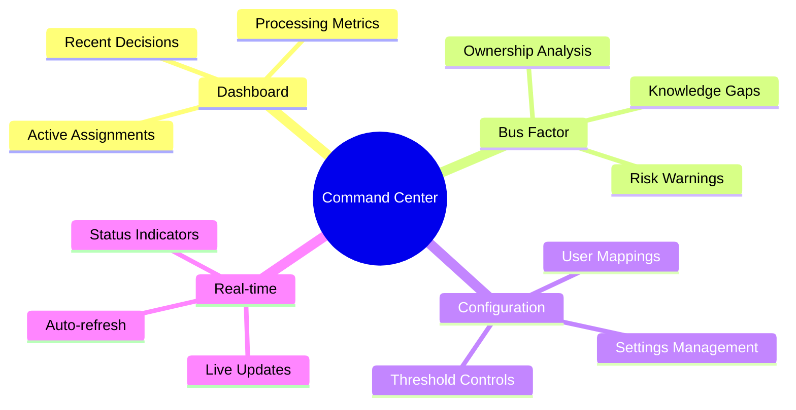
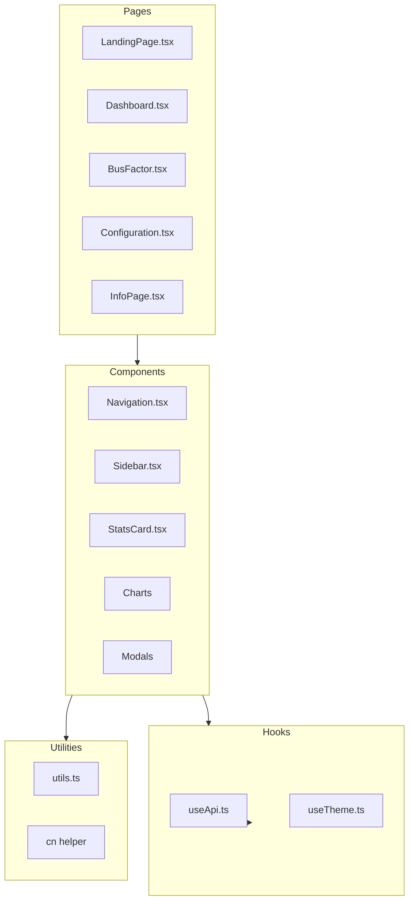
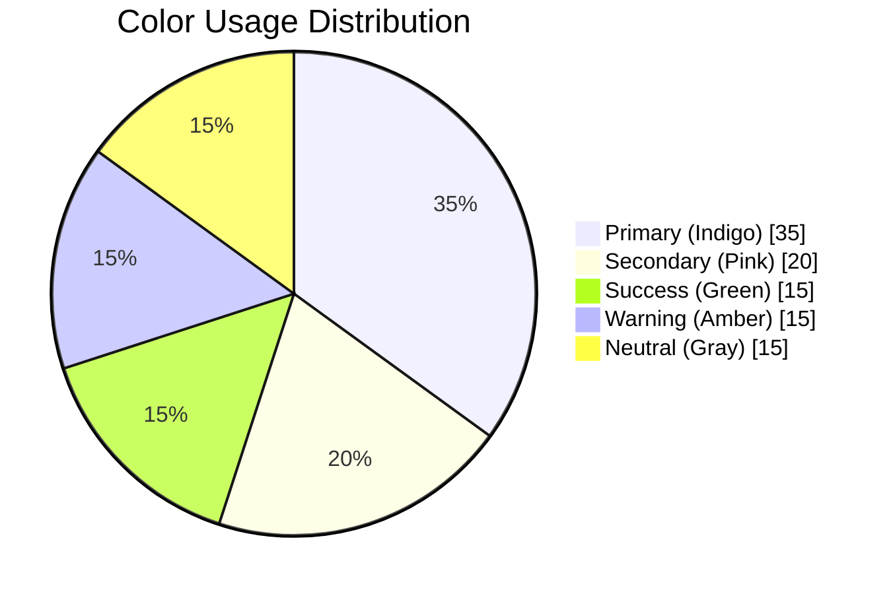
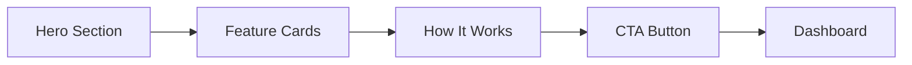

# Mahoraga Frontend - Command Center

<div align="center">

[](https://react.dev)
[](https://typescriptlang.org)
[](https://vitejs.dev)
[](https://tailwindcss.com)

**The mission control dashboard for autonomous bug triage**

</div>

---

## Overview

The Command Center is a React-based dashboard that provides real-time visibility into the Mahoraga triage system. Monitor team health, track bug assignments, analyze code ownership risks, and configure system behavior—all from a modern, responsive interface.

---

## Features



### Key Capabilities

| Feature | Description |
|---------|-------------|
| **Team Dashboard** | View active assignments, metrics, and recent triage decisions |
| **Bus Factor Monitor** | Identify knowledge silos and ownership concentration risks |
| **Configuration Panel** | Adjust confidence thresholds and user mappings |
| **Real-time Updates** | Auto-refreshing data with TanStack Query |
| **Modern UI** | Glassmorphism, animations, and dark mode support |

---

## Architecture



---

## Project Structure

```
frontend/src/
├── main.tsx              # Application entry
├── App.tsx               # Root component with routing
├── index.css             # Global styles and design tokens
├── pages/                # Route pages
│   ├── LandingPage.tsx  # Welcome and feature showcase
│   ├── Dashboard.tsx    # Team statistics
│   ├── BusFactor.tsx    # Ownership analysis
│   ├── Configuration.tsx # Settings management
│   └── InfoPage.tsx     # Glossary and help
├── components/           # Reusable UI components
│   ├── ui/              # Base components (shadcn/ui)
│   ├── Navigation.tsx   # Top navigation
│   ├── Sidebar.tsx      # Side navigation
│   ├── Breadcrumbs.tsx  # Path navigation
│   └── ...
├── hooks/                # Custom React hooks
│   └── useApi.ts        # API data fetching
├── lib/                  # Utilities
│   └── utils.ts         # Helper functions
└── test/                 # Test files
```

---

## Quick Start

### Prerequisites

- Node.js 18+
- npm or pnpm

### Installation

```bash
# Install dependencies
npm install

# Start development server
npm run dev
```

Available at: `http://localhost:5173`

### Available Scripts

| Script | Description |
|--------|-------------|
| `npm run dev` | Start development server |
| `npm run build` | Build for production |
| `npm run preview` | Preview production build |
| `npm run test` | Run tests |
| `npm run lint` | Lint code |

---

## Design System

### Color Palette



### UI Components

Built with [shadcn/ui](https://ui.shadcn.com) + [Radix UI](https://www.radix-ui.com):

| Component | Usage |
|-----------|-------|
| `Button` | Actions and CTAs |
| `Card` | Content containers |
| `Dialog` | Modals and confirmations |
| `Select` | Dropdowns |
| `Slider` | Threshold controls |
| `Switch` | Toggle settings |
| `Table` | Data display |
| `Tabs` | View switching |

### Styling Features

- **Dark Mode** - System preference detection
- **Glassmorphism** - Backdrop blur effects
- **Micro-animations** - Smooth transitions
- **Responsive** - Mobile-first design

---

## Pages Overview

### Landing Page

The entry point showcasing Mahoraga's capabilities:



### Dashboard

Real-time team statistics and metrics:

- Active assignments per developer
- Recent triage decisions
- Processing time trends
- Success rate metrics

### Bus Factor Monitor

Code ownership risk analysis:

- Single-contributor warnings
- Knowledge distribution charts
- Ownership percentage breakdown
- Risk scoring by file/module

### Configuration Panel

System settings management:

- Confidence threshold sliders
- Draft PR toggle
- Duplicate detection window
- User email-to-Slack mappings

---

## API Integration

Uses TanStack Query for data fetching:

```typescript
// Example: Fetching dashboard stats
const { data, isLoading, error } = useQuery({
  queryKey: ['dashboard', 'stats'],
  queryFn: () => fetch('/api/dashboard/stats').then(res => res.json()),
  refetchInterval: 30000, // Auto-refresh every 30s
});
```

### API Endpoints Used

| Endpoint | Page |
|----------|------|
| `GET /api/dashboard/stats` | Dashboard |
| `GET /api/dashboard/bus-factor` | Bus Factor |
| `GET /api/config/settings` | Configuration |
| `PUT /api/config/settings` | Configuration |
| `GET /api/config/users` | Configuration |

---

## Testing

```bash
# Run all tests
npm run test

# Run specific test file
npm run test -- src/test/Dashboard.test.tsx

# Run with coverage
npm run test -- --coverage
```

### Test Structure

```
test/
├── Dashboard.test.tsx   # Dashboard component tests
├── BusFactor.test.tsx   # Bus factor analysis tests
└── setup.ts             # Test configuration
```

---

## Configuration

### Vite Config

```typescript
// vite.config.ts
export default defineConfig({
  plugins: [react()],
  server: {
    proxy: {
      '/api': 'http://localhost:8000'
    }
  }
});
```

### Tailwind Config

Custom theme extensions in `tailwind.config.js`:

- Custom color palette
- Animation utilities
- Typography settings
- Glassmorphism utilities

---

## Docker

```dockerfile
FROM node:18-alpine
WORKDIR /app
COPY package*.json ./
RUN npm ci
COPY . .
EXPOSE 5173
CMD ["npm", "run", "dev", "--", "--host"]
```

---

## Performance

| Metric | Target |
|--------|--------|
| First Contentful Paint | <1.5s |
| Time to Interactive | <3s |
| Bundle Size (gzipped) | <200KB |
| Memory Usage | ~100MB |

---

## Tech Stack

| Category | Technology |
|----------|------------|
| **Framework** | React 18 |
| **Language** | TypeScript 5 |
| **Build** | Vite 5 |
| **Styling** | Tailwind CSS 3 |
| **Components** | Radix UI / shadcn |
| **State** | TanStack Query |
| **Charts** | Recharts |
| **Testing** | Vitest + Testing Library |

---

<div align="center">

**Part of the [Mahoraga](../README.md) Autonomous Bug Triage System**

</div>
